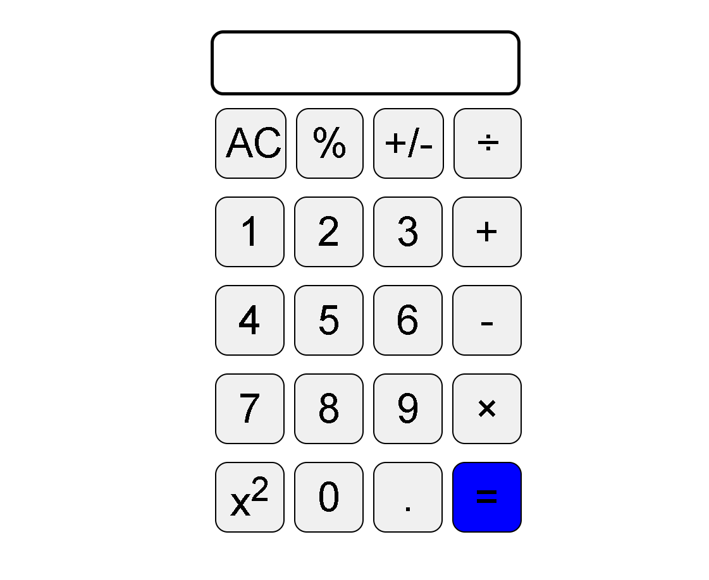

# Calculator App

A simple and responsive calculator built using HTML, CSS, and JavaScript.

## Features

* Basic arithmetic operations
* Interactive user interface
* Responsive design
* Real-time calculation display

## Technologies Used

* HTML5
* CSS3
* JavaScript

## Preview

## Author

Sujata Yadav

